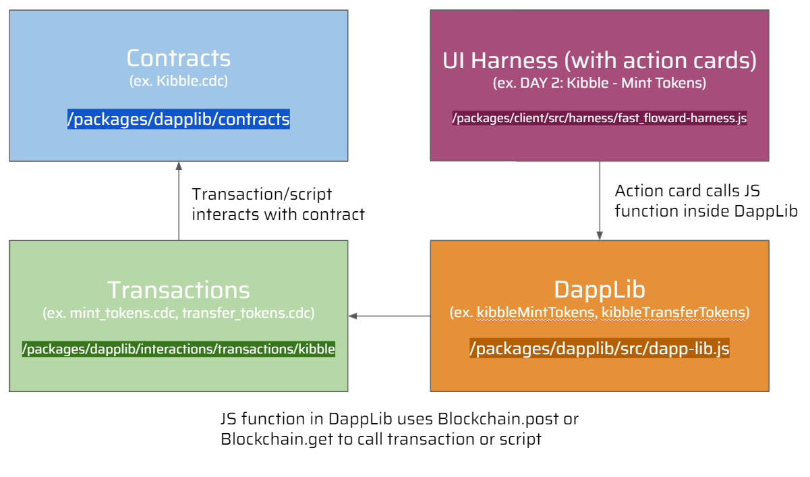
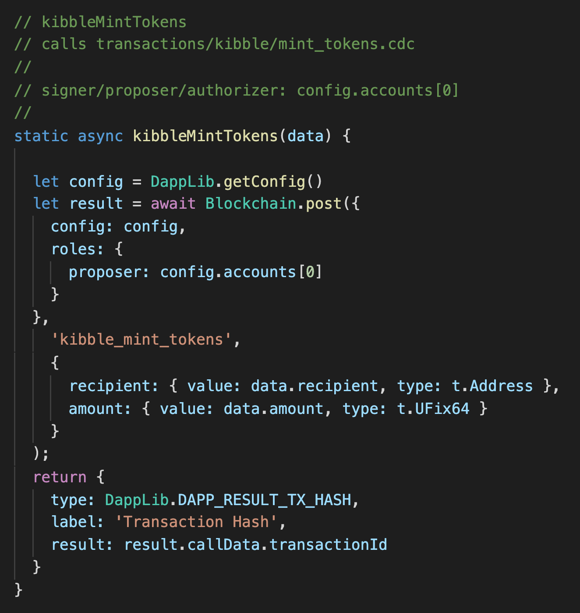
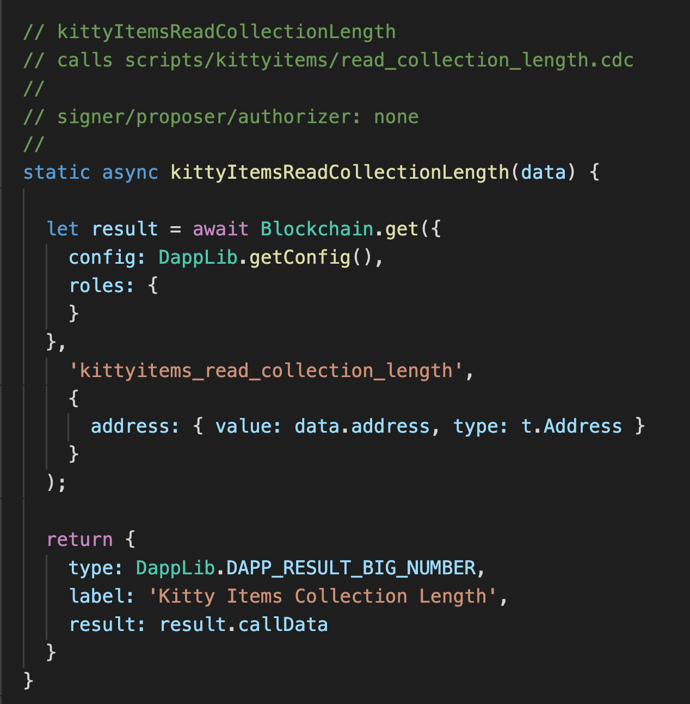

# Flow 快速入门 | 第二周 | 第三天

嗨！这是你最最可爱的老朋友Jacob，我将带领你完成第二周第三天的内容。昨天，我们复习了我们从DappStarter上得到的DApp中的3个合约。今天，我们将研究如何修改我们的DappLib、交易和脚本，以便学习如何与我们在DappStarter上的合约互动。

让我们直接开始吧。

# 视频

- [DappLib, 交易, 和脚本](https://www.youtube.com/watch?v=Czg3mMLw1I4)

# DappLib

The DappLib 位于 `packages/dapplib/src/dapp-lib.js`

从视频 [Nik's architecture video on DappStarter during Week 2 Day 1](https://youtu.be/scZZiFXfXa4),我们看到DappLib在我们的项目中极为重要。其中有一些JavaScript函数，它们通过`Blockchain.post`来调用交易或是通过`Blockchain.get`来执行脚本。

你可能想知道这些DappLib函数是如何调用的。暂时不必担心这个问题，我这里先给出一个简短的总结：它们是在客户端被**action cards**调用的。我们明天将学习更多关于**action cards**以及如何从客户端调用我们的DappLib函数。

我们可以快速看一下昨天的ReadMe中的图。




**今天，我们将看一下DappLib和交易/脚本。现在，客户端已经被配置好，可以调用我们的DappLib函数，并且这些函数会在今天由你在W2Q5中编写。**

## 在DappLib中设置一个交易函数

让我们来看下怎样在DappLib中设置一个交易函数：



以上是一个例子，它展示了如何设置DappLib函数来调用交易。我们首先将结果设置为对`Blockchain.post`的异步调用，因为它是一个交易。我们将`Blockchain.post`的第一个参数传递给一个对象，该对象会接收两个东西：
1) 一个配置信息（我们可以设置为`DappLib.getConfig()'）
2) 一个 `roles` 对象， 它会接收一个 `proposer`

`proposer` 是签署交易的人。通常情况下，我们会将其设置为`data.signer`，它来自于从客户端传入的数据对象。在明天的视频之前，你尚且不必担心这个是怎么运作的，所以我为你把`proposer`放在每个函数之前的注释中。有时，你会发现`proposer`就是`config.accounts[0]`。这是因为如果你查看`dapp-config.json`，你可以看到一个账户对象。我们使用`accounts[0]`来获取用于部署所有项目合约的账户。如果我们想让`proposer`始终是合同部署的账户，这就很有用了（例如，如果我们在合约部署的账户存储中存储了Minter资源）。

我们传给`Blockchain.post`的下一个参数是交易所在目录的名称，然后是下划线和交易文件的名称，都在引号中。例如，如果我们想调用`transactions/kibble/mint_tokens.cdc'，我们将输入 "kibble_mint_tokens"。
接下来，我们放一个对象，这个对象接收我们交易的所有参数。如果你看一下`kibble_mint_tokens.cdc`，你会看到它接收两个参数：收件人（一个地址）和金额（一个UFix64）。对于每个参数，你要写出参数的名称，并将其映射到一个对象中，该对象接收一个`value`（从客户端传来的）和一个`type`（参数的类型）。我们用FCL通过`t.{the type}`来实现这个。下面是一个例子：


```javascript
{
  recipient: {value: data.recipient, type: t.Address},
  amount: {value: data.amount, type: t.UFix64}
}
```

**注意**: 如果类型是 `t.UInt64`, 你必须将这个值包在`parseInt()`中，下面是一个例子：

```javascript
{
  typeID: {value: parseInt(data.typeID), type: t.UInt64}
}
```

最后我们将结果返回给客户端。对于交易而言，你总是可以输入这段代码：

```javascript
return {
    type: DappLib.DAPP_RESULT_TX_HASH,
    label: 'Transaction Hash',
    result: result.callData.transactionId
}
```

这就是返回给客户的东西。如果你使用的**action card**（它有一个橙色的提交按钮，意味着它是一个交易），你会看到一个绿色的矩形出现，标签是 "交易哈希"。这是由上面的返回的对象决定的。我们来看看这对脚本来说有什么不同。


## 在DappLib中设置脚本函数



设置一个脚本函数，如上图所示，与我们设置交易函数的方式非常相似。不过有几个关键的区别：

1) 我们使用`Blockchain.get`而不是`Blockchain.post`。
2) 我们让`roles`对象为空，意味着我们不设置`proposer`（这是一个脚本...所以没有人签署它）。
3) 我们可以不总是返回一个交易哈希值，而是做这样的事情：
   
```javascript
return {
    type: DappLib.DAPP_RESULT_BIG_NUMBER,
    label: 'Kibble Balance',
    result: result.callData
}
```
类型可以是从很多选项中选一个，但你希望它与你的脚本的返回值相匹配。如果你的脚本返回一个UInt64、Int或UFix64，就使用`DAPP_RESULT_BIG_NUMBER`。如果你的脚本返回一个数组，使用`DAPP_RESULT_ARRAY`。如果你的脚本返回一个字典，使用`DAPP_RESULT_OBJECT`。在dapp-lib.js的底部也有其他的。

标签是显示在客户端的返回值旁边的东西。

# 交易和脚本文件

Cadence交易和脚本可以在`packages/dapplib/interactions`中找到。它们按Kibble、Kitty Items和Kitty Items Market分开。

如果你点击这些cadence文件，你可能会注意到我们导入合约的方式很独特。我们并非是这样：

`import KittyItems from './kittyitems.cdc'`

我们是这样做的:

`import KittyItems from Project.KittyItems`

这使事情变得更简单并且更容易阅读。之所以是`Project.KittyItems`，是因为我们的KittyItems合约是在`contracts/Project`文件夹中定义的。你也可以在`src/dapp-config.json`中看到这个命名。


# 热加载

同样重要的是要注意，DappStarter支持热加载。如果你对你的合约、事务、脚本、dapp-lib.js或我们将在明天的内容中介绍的客户端做了任何改变，你将不必重新运行`yarn start`。你的dApp会自动为你重新编译。


# 任务

今天我会给大家布置一个任务，`W2Q5`。你将**仅仅只要**修改`transactions/kittyitems/mint_kitty_item.cdc`，`transactions/kittyitems/transfer_kitty_item.cdc`，`scripts/kittyitems/read_collection_ids.cdc`，和`src/dapp-lib.js`。在处理这些任务之前，请务必观看上面的视频。


- `W2Q5` – 伟大的DappLib

在这个任务中，我希望你在你的`dapp-lib.js`中寻找所有未实现的函数。你可以通过搜索文件中的 "TODO "来找到它们。有2个交易函数和1个脚本函数我希望你能实现。我已经为你定义了每个函数的proposer是谁，所以你的工作是按照上面的描述设置函数，并确保你为你要调用的交易/脚本传递正确的参数。

接下来，你需要去实现交易和脚本本身。有2个事务（`transactions/kittyitems/mint_kitty_item.cdc`，`transactions/kittyitems/transfer_kitty_item.cdc`）和1个脚本（`scripts/kittyitems/read_collection_ids.cdc`）你需要实现。我已经为你留下了评论，以帮助你完成任务。
一旦你完成了这个任务，你应该能够成功运行第三天的所有 **action cards**。请提交工作中的第三天行动卡的截图，以及你的dapp-lib和交易/脚本。在[本视频](https://www.youtube.com/watch?v=zFtc4QLrxas)的结尾，我已经描述了你的行动卡在完成这个任务后应该是什么样子。

祝你好运. 下一站见~


